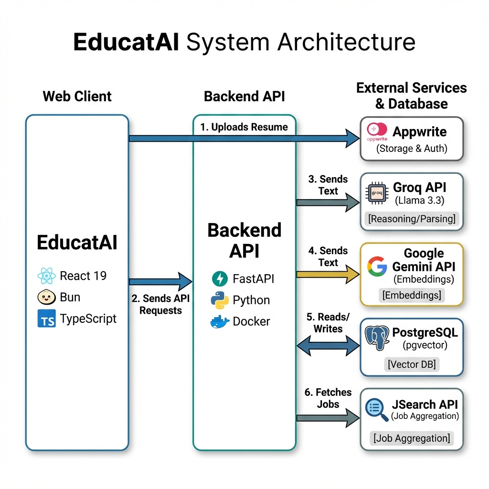

# EducatAI - AI-Powered Career Mentorship Platform

> An intelligent career mentorship platform that leverages AI agents to provide personalized guidance, job recommendations, and learning resources for career development.

[](https://fastapi.tiangolo.com/)
[](https://react.dev/)
[](https://langchain-ai.github.io/langgraph/)
[](https://www.python.org/)
[](https://educat.appwrite.network)

## 🌐 Live Demo

Check out the live application here: **[EducatAI](https://educat.appwrite.network)**

Backend API docs: **[API Docs](https://educat-api.saumyajit.dev/redoc)**

## 🎯 Overview

EducatAI is a full-stack career mentorship platform that combines the power of AI agents, large language models, and real-time data to provide personalized career guidance. The platform helps users:

- 📄 **Parse and analyze resumes** to extract skills, experience, and qualifications
- 💼 **Discover real job opportunities** from LinkedIn, Indeed, Glassdoor, and other platforms
- 📊 **Analyze market trends** including salary insights, demand forecasts, and skill gaps
- 📚 **Get personalized learning recommendations** tailored to career goals
- 🗺️ **Generate custom learning roadmaps** with milestones and progress tracking
- 💬 **Chat with an AI career mentor** for guidance and advice

## 🏗️ Architecture



### Tech Stack

**Backend:**

- **FastAPI** - Modern, high-performance Python web framework
- **LangGraph** - Stateful AI agent orchestration framework
- **PostgreSQL** - Primary database with pgvector extension
- **Groq (Llama 3.3 70B)** - High-performance LLM for agent reasoning and resume parsing
- **Google Gemini Embeddings** (`text-embedding-004`) - Semantic search and memory
- **JSearch API** (RapidAPI) - Real-time job data aggregation

**Frontend:**

- **React 19** - Modern UI with hooks and concurrent features
- **TypeScript** - Type-safe development
- **Bun** - Fast JavaScript runtime & package manager
- **Vite** - Lightning-fast build tool
- **Tailwind CSS 4** - Utility-first styling
- **React Router 7** - Client-side routing
- **Appwrite** - Authentication, User Management, and File Storage

**AI & ML:**

- **LangChain** - LLM application framework
- **Groq API** - Ultra-fast inference for Llama models
- **Google Generative AI** - Semantic embeddings
- **LangGraph State Machine** - Conversational agent state management

## ✨ Key Features

## ✨ Key Features

### 1. 🗺️ Dynamic Roadmap Agent
- **Intelligent Planning**: Instead of static templates, the agent acts as an intelligent planner.
- **Role Inference**: Analyzes user skills (e.g., Python + Pandas) to infer best-fit roles (e.g., "Data Scientist") if none are specified.
- **Skill Gap Analysis**: Compares user profile against real-time market trends to identify missing skills.
- **Agentic Planning**: Generates multi-step learning paths with specific, action-oriented milestones (e.g., "Deploy Microservices on AWS").

### 2. 🤖 AI Mock Interviewer
- **Real-time Technical Interviews**: Conducts text-based technical interviews.
- **Dynamic Questioning**: Generates relevant questions based on target role and difficulty level.
- **Feedback Loop**: Analyzes user answers and provides immediate feedback on correctness and clarity.
- **Performance Report**: Generates a summary of strengths and areas for improvement.

### 3. 📄 Resume & Profile Engine
- **AI-Powered Parsing**: Parses PDF/DOCX resumes to extract skills, education, and experience automatically.
- **Appwrite Storage**: Securely uploads and persists resume files.
- **Profile Generation**: Populates the UserProfile database to personalize all other features.

### 4. 💼 Job Recommendation Engine
- **Smart Matching**: Matches structured user profiles against job opportunities.
- **Market Analysis**: Analyzes market trends (salary, demand) for specific roles.
- **Real-time Data**: Aggregates jobs from major platforms via JSearch API.

### 5. 🧠 Long-term Memory
- **Context Awareness**: Remembers past interactions, completed milestones, and interview performance.
- **Evolving Guidance**: Allows the "Mentor" to give context-aware advice that evolves as the user learns.

### 6. 📊 Market Trends Analysis
- AI-powered analysis of current market conditions
- Salary insights and compensation trends
- Job demand forecasting
- Industry-specific recommendations

## 🚀 Getting Started

### Prerequisites

### Prerequisites

- **Docker & Docker Compose** (Recommended for Backend)
- **Bun** (for Frontend)
- **API Keys**:
  - **Groq API Key** (for Llama 3.3 reasoning)
  - **Google Gemini API Key** (for Embeddings)
  - **JSearch API** (RapidAPI)
  - **Appwrite Project & Bucket ID**

### Backend Setup (via Docker)

1.  **Clone the repository**

    ```bash
    git clone https://github.com/agspades/educat-anokha.git
    cd educat-anokha/server
    ```

2.  **Configure Environment**

    ```bash
    cp .env.example .env
    ```

    Edit `.env` with your API keys (Groq, Google, JSearch).
    *Note: Docker Compose will automatically handle the database connection.*

3.  **Run with Docker Compose**

    ```bash
    docker compose up -d --build
    ```

4.  The API will be available at `http://localhost:8085` (exposed port)
    *   API Documentation: `http://localhost:8085/docs`

    *Note: The internal container port is 8000, mapped to 8085 on host to avoid conflicts.*

The API will be available at `http://localhost:8000`

- API Documentation: `http://localhost:8000/docs`
- ReDoc: `http://localhost:8000/redoc`

### Frontend Setup

1. **Navigate to client directory**

```bash
cd ../client
```

2. **Install dependencies**

```bash
bun install
```

3. **Configure Environment** 
   Create `.env` file in `client/` directory:

```env
VITE_APPWRITE_ENDPOINT=https://cloud.appwrite.io/v1
VITE_APPWRITE_PROJECT_ID=your_project_id
VITE_APPWRITE_BUCKET_ID=your_storage_bucket_id
VITE_API_BASE_URL=http://localhost:8085
```
*(Note: VITE_API_BASE_URL should point to 8085 if using Docker backend)*

4. **Run development server**

```bash
bun dev
```

The frontend will be available at `http://localhost:5173`

## 📡 API Endpoints

### Health & Status

- `GET /` - Health check and API version

### Agent Interactions

- `POST /agent/message` - Send message to AI career mentor
- `GET /agent/memory/summary` - Get user's memory summary
- `GET /agent/progress` - Get weekly progress insights

### Resume & Profile

- `POST /agent/resume/parse` - Upload and parse resume (PDF/DOCX)
- Returns structured data: name, email, skills, experience, education

### Job Recommendations

- `POST /agent/jobs/recommend` - Get personalized job recommendations

```json
{
  "user_id": "user_123",
  "limit": 10,
  "location": "Remote",
  "employment_type": "FULLTIME"
}
```

### Market Trends

- `POST /agent/market/trends` - Analyze market trends for target role

```json
{
  "user_id": "user_123"
}
```

### Learning Resources

- `POST /agent/learning/resources` - Get personalized learning recommendations

```json
{
  "user_id": "user_123",
  "topic": "Python Backend Development",
  "difficulty": "intermediate"
}
```

### Roadmaps & Progress

- `POST /agent/roadmap/regenerate` - Generate new learning roadmap
- `POST /agent/milestone/complete` - Mark milestone as completed
- `POST /agent/job/application` - Log job application outcome

## 🧪 Testing

### Test Resume Parsing

```bash
# Place test PDF in test-docs/ directory
cd server
python -c "
from resume_parser import resume_parser
result = resume_parser.parse_resume('test-docs/sample_resume.pdf')
print(result)
"
```

### Test Job Recommendations

```bash
# Direct test of JSearch API integration
cd server
python test_jsearch.py
```

### Test API Endpoints

```bash
# Using curl
curl -X POST http://localhost:8000/agent/jobs/recommend \
  -H "Content-Type: application/json" \
  -d '{
    "user_id": "test_user",
    "limit": 5
  }'
```

## 📁 Project Structure

```
educat-anokha/
├── client/                    # React frontend
│   ├── src/
│   │   ├── pages/            # Page components
│   │   ├── auth-components/  # Authentication UI
│   │   ├── landing-page-components/
│   │   ├── profile-components/
│   │   ├── roadmap-components/
│   │   ├── contexts/         # React contexts
│   │   ├── hooks/            # Custom hooks
│   │   ├── lib/              # Utilities (Appwrite)
│   │   └── main.tsx          # Entry point
│   ├── package.json
│   └── vite.config.ts
│
├── server/                    # FastAPI backend
│   ├── main.py               # FastAPI app & endpoints (11 endpoints)
│   ├── database.py           # SQLAlchemy models & setup
│   ├── config.py             # Pydantic settings
│   ├── schemas.py            # Request/response models
│   ├── services.py           # CareerMentorService (LangGraph agent)
│   ├── resume_parser.py      # Resume parsing with Groq/Llama 3.3
│   ├── job_recommender.py    # Job matching with JSearch + Gemini Embeddings
│   ├── learning_resources.py # Learning resource recommendations
│   ├── requirements.txt      # Python dependencies
│   ├── .env.example          # Environment template
│   ├── test_jsearch.py       # JSearch API test script
│   └── docs/
│       └── JSEARCH_SETUP.md  # JSearch API setup guide
│
└── README.md                  # This file
```

## 🔑 API Keys Setup

### 1. Groq (Llama 3.3)

1. Visit [console.groq.com](https://console.groq.com/)
2. Create account and generate API key
3. Add to `.env`: `GROQ_API_KEY=gsk_...`

### 2. Google Gemini (Embeddings/Memory)

1. Visit [aistudio.google.com](https://aistudio.google.com/)
2. Create account and generate API key
3. Add to `.env`: `GOOGLE_API_KEY=AIza...`

### 3. JSearch API (RapidAPI)

1. Visit [rapidapi.com/letscrape-6bRBa3QguO5/api/jsearch](https://rapidapi.com/letscrape-6bRBa3QguO5/api/jsearch)
2. Subscribe to Basic plan (100 requests/month free)
3. Copy API key from "Code Snippets" section
4. Add to `.env`:

```env
JSEARCH_API_KEY=your_key_here
JSEARCH_API_HOST=jsearch.p.rapidapi.com
```

Detailed setup: [server/docs/JSEARCH_SETUP.md](server/docs/JSEARCH_SETUP.md)

## 🔧 Configuration

Key settings in `server/config.py`:

```python
# Database
DATABASE_URL = "postgresql://..."

# AI Models
GROQ_API_KEY = "gsk_..."
GROQ_MODEL = "llama-3.3-70b-versatile"
GOOGLE_API_KEY = "AIza..." # For Embeddings

# JSearch API
JSEARCH_API_KEY = "..."
JSEARCH_API_HOST = "jsearch.p.rapidapi.com"

# Application
APP_NAME = "EducatAI Career Mentor"
LOG_LEVEL = "INFO"
```

## 🐛 Troubleshooting

### Resume Parser Returns Empty Data

- **Cause**: PDF is image-based (scanned document)
- **Solution**: Use text-based PDFs or add OCR support (Tesseract)

### JSearch API Returns 0 Jobs

- **Cause**: Query too specific or rate limit reached
- **Solution**: Simplify search query or wait 60 seconds between requests
- **Free tier limit**: 100 requests/month

### Database Connection Error

- **Check**: PostgreSQL is running (`sudo systemctl status postgresql`)
- **Check**: Database exists (`psql -l | grep educat_db`)
- **Check**: pgvector extension installed (`psql educat_db -c "\dx"`)

### Import Errors

- **Solution**: Ensure virtual environment is activated
- **Solution**: Reinstall dependencies: `pip install -r requirements.txt`

## 🚧 Known Limitations

1. **Resume Parser**: Only works with text-based PDFs (not scanned images)
2. **JSearch API**: Free tier limited to 100 requests/month
3. **Real-time Data**: Job listings may have slight delays (API caching)
4. **Semantic Matching**: Match scores are estimates based on text similarity

## 🔮 Future Enhancements

- [ ] Add OCR support for image-based PDFs (Tesseract/AWS Textract)
- [x] Implement caching for JSearch API responses
- [x] Add interview preparation module
- [ ] Integration with more job boards (LinkedIn Jobs API)
- [ ] Resume builder and optimization suggestions
- [ ] Salary negotiation guidance
- [ ] Company culture insights
- [ ] Networking recommendations

## 👥 Contributing

Contributions are welcome! Please feel free to submit a Pull Request.

1. Fork the repository
2. Create your feature branch (`git checkout -b feature/AmazingFeature`)
3. Commit your changes (`git commit -m 'Add some AmazingFeature'`)
4. Push to the branch (`git push origin feature/AmazingFeature`)
5. Open a Pull Request

## 📄 License

This project is licensed under the MIT License - see the LICENSE file for details.

## 🙏 Acknowledgments

- **Groq** for ultra-fast Llama 3.3 inference
- **Google Gemini** for semantic embeddings
- **Appwrite** for seamless backend services
- **RapidAPI/JSearch** for job data aggregation
- **LangChain** and **LangGraph** for AI orchestration
- **FastAPI** for high-performance API handling

## 📞 Support

For questions or issues:

- Open an issue on GitHub
- Check the [documentation](server/docs/)
- Review API docs here: [API Docs](https://educat-api.saumyajit.dev/redoc)

---

Built with ❤️ using LangGraph, FastAPI, and React
